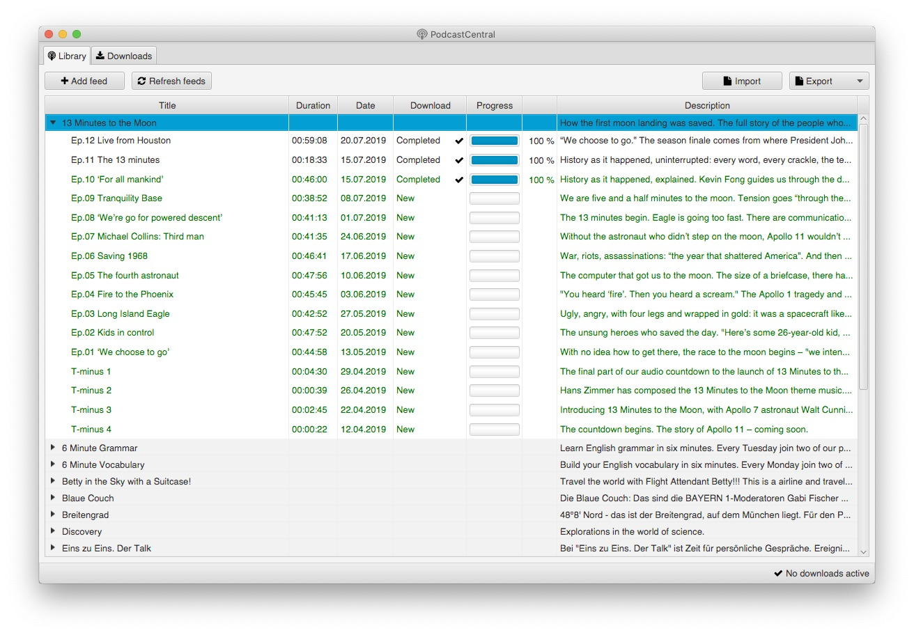

# PodcastCentral

The PodcastCentral scratches my personal itch of wanting to have a podcast management program (aka "Podcatcher") that focuses primarily on my special usecase for podcasts: Listening to them in the car.

This means I don't really care about a fancy UI for *playing* podcasts but a fancy UI for *managing* podcasts and *downloading* podcasts.

iTunes used to do a pretty good job for this.
I wasn't really happy with its UI but it had everything that I needed: A **list view** in which I could see an overview of all the podcasts I was subscribed to and a list of episodes.

But since the retirement of iTunes in macOS Catalina and the introduction of the Podcasts app that UI is gone. The Podcasts app might be great for listening to *individual* podcasts but it isn't in any way comfortable for *downloading* podcasts (which basically means copy them to another location on the local file system).

Long story short, that's where the PodcaseCentral comes into play: It fulfills all the requirements that I have: Listing all podcasts and all episodes and provide an easy way to copy them to the local file system (from where they are synchronized to a USB stick via rsync, but that's another story).

## User interface

## Building the application

### Generic build

The application is written in pure Java, using a JavaFX frontend. It's therefore platform independent and can be built and run on every platform supporting a Java SDK.

For building it simply checkout the repository from GitHub and call the Maven package target on the command line:

    $ git clone https://github.com/perdian/podcastcentral.git
    $ cd podcastcentral
    $ mvn clean package -Pgeneric-bundle
    $ java -jar podcastcentral-ui/target/podcastcentral.jar

### macOS build

On macOS a simplified build that directly generates a DMG archive from which the application can be installed or distributed can be built using the following commands:

    $ git clone https://github.com/perdian/podcastcentral.git
    $ cd podcastcentral
    $ mvn clean package -Pmacos-bundle
    $ open podcastcentral-ui/target/PodcastCentral.app
